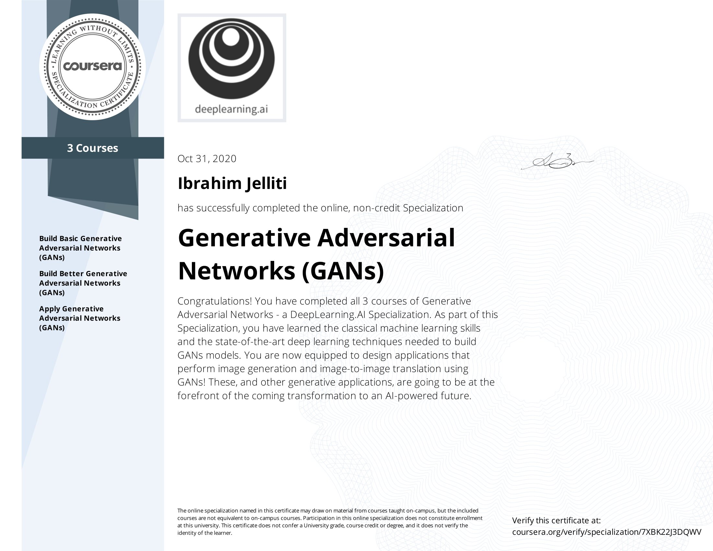

# Deeplearning.ai Generative Adversarial Networks Specialization
This repository contains my full work and notes on upcoming [Deeplearning.ai GAN Specialization](https://www.deeplearning.ai/generative-adversarial-networks-specialization/)
the GAN specialization has two courses which can be taken on Coursera. The two courses are:
1. [Course 1: Build Basic Generative Adversarial Networks](https://github.com/ijelliti/Deeplearning.ai-Generative-Adversarial-Networks-Specialization/tree/master/1%20-%20Build%20Basic%20Generative%20Adversarial%20Networks)
2. [Course 2: Build Better Generative Adversarial Networks](https://github.com/ijelliti/Deeplearning.ai-Generative-Adversarial-Networks-Specialization/tree/master/2%20-%20Build%20Better%20Generative%20Adversarial%20Networks)
3. [Course 3: Apply Generative Adversarial Networks (GANs)](https://github.com/ijelliti/Deeplearning.ai-Generative-Adversarial-Networks-Specialization/tree/master/3%20-%20Apply%20Generative%20Adversarial%20Network%20(GAN))
# My GAN Specialization Certification

